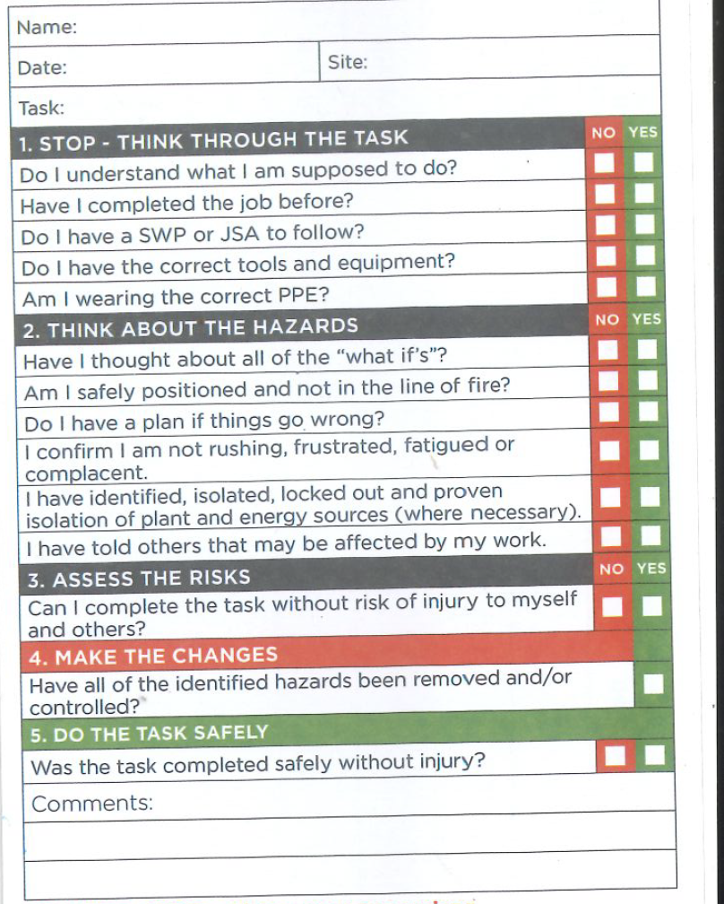

# Project01: Take5

Deployed URL: https://peterwonghg.github.io/Project01/

GitHub URL: https://github.com/peterwonghg/Project01.git

## Task
```
Take5 is a process where everyone conduct health and safety checks to mittigate hazards exposure at a task level

```

## User Story

```md
AS AN employer
I WANT an App to complete a Take5 virtually
SO THAT I can comply with my legal Occupational Health Safety and Environment (OHSE) responsibility
```

## Acceptance Criteria

```md
AS AN employee
GIVEN when I start my task, I have to complete my Take5 before I start my task

WHEN I open the Home Page
THEN I enter my name and work site location and task through the submit button
WHEN I entered my site information
THEN I'll be taken to a STOP Title Page
WHEN I clicked the Take5 button
THEN I am presented with a series of Take5 questions with a Yes/No answer
WHEN I answered YES to everything
THEN I will be taken through the HAZARD, WEATHER (only if the task is outdoors) and eventually to a Declaration Page
WHEN I answer NO to anything
THEN I am presented with a message NOT to proceed with my task and contact my supervisor and advice to retake the Take5 once clarified with Supervisor
WHEN I am in the Declaration Page
THEN I will review all the data and answers submitted and tick a declaration tick box
WHEN I submit my declation
THEN I am taken to the FormSubmit API
WHEN the form is successfully submitted
THEN I will retrive the email sent by FormSubmit to view the form
```

## Hardcopy of a Take5 form



## Mock


## References

References:

Email API
https://smtpjs.com/

Department of Primary Industries and Regional Development – Agricultural Food – Weather API 2.0
https://www.agric.wa.gov.au/weather-api-20


## how to use smtpjs API
How to use the smtp.js API to send emails with JavaScript…
https://www.youtube.com/watch?v=MV-Aqkjju64


## good responsive form formation
Responsive Registration Form in HTML CSS & Javascript - CodingLab
https://www.youtube.com/watch?v=wL9YzgA13c4


## using field set etc another responsive form formation
How to Make Responsive Registration Form in HTML and CSS | HTML CSS Projects For Practice
https://www.youtube.com/watch?v=ZIqrmxT9r5U


Helmet Image – Ricardo Gomez Angel
https://unsplash.com/photos/WfeKQT3Wf0A

How to collect form fields and show them on the same page using JavaScript
https://www.youtube.com/watch?v=o6ueQBrcKrs

How to make a simple JavaScript quiz (simple question and answer)
https://simplestepscode.com/javascript-quiz-tutorial/

Collecting Form Data using JavaScript
https://www.youtube.com/watch?v=PQs8mwWmP6E
 
How to Email Contact Us Form Data using FormSubmit.co
https://www.youtube.com/watch?v=14vpfSyIysM
 
 
FORMSUBMIT API Documentation
https://formsubmit.co/api-documentation
 

Mail Golem
cejinima@mailgolem.com
ledegose@mail.golem.com


Go Make Things
https://gomakethings.com/four-different-ways-to-inject-text-and-html-into-an-element-with-vanilla-javascript/

Pass a Variable Value from One HTML Page to Another
https://www.youtube.com/watch?v=x0VcigW9kN0


Populate form with localStorage
https://stackoverflow.com/questions/10412103/populate-form-with-localstorage

Populate form with data from different sources with JavaScript
https://plumsail.com/docs/forms-web/designer/javascript/populate-fields.html


chrome links
https://docs.google.com/presentation/d/1UuJxM-5idujYe47ZJ6cbk93pCPn5JATZC4MY9E-5DG8/edit#slide=id.g29f43f0a72_0_0


