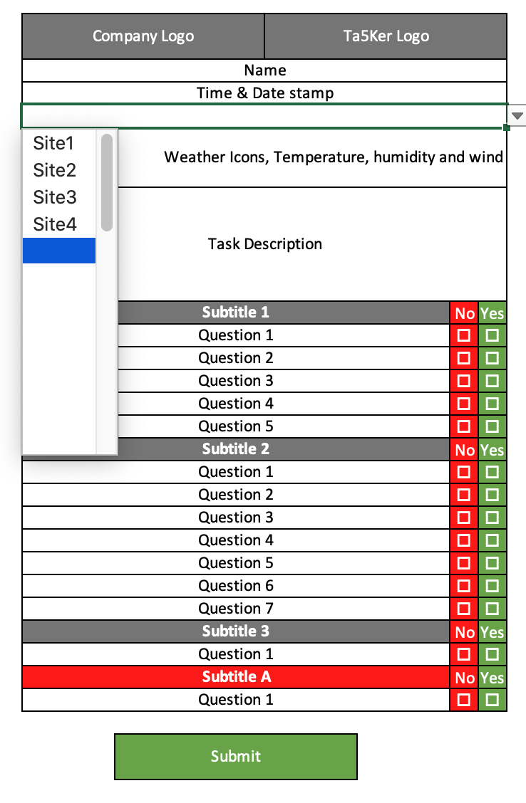

# Project01: Take5

Deployed URL:

GitHub URL: 

## Task
```
Take5 is a process where everyone conduct health and safety checks to mittigate hazards exposure at a task level

```

## User Story

```md
AS AN employer
I WANT an App to complete a Take5 virtually
SO THAT I can comply with my legal Occupational Health Safety and Environment (OHSE) responsibility
```

## Acceptance Criteria

```md
AS AN employee
GIVEN when I start my task, I have to complete my Take5 before I start my task

WHEN I open the Home Page
THEN I enter my name and work site location and task through the submit button
WHEN I entered my site information
THEN I'll be taken to a STOP Title Page
WHEN I clicked the Take5 button
THEN I am presented with a series of Take5 questions with a Yes/No answer
WHEN I answered YES to everything
THEN I will be taken through the HAZARD, WEATHER (only if the task is outdoors) and eventually to a Declaration Page
WHEN I answer NO to anything
THEN I am presented with a message NOT to proceed with my task and contact my supervisor and advice to retake the Take5 once clarified with Supervisor
WHEN I am in the Declaration Page
THEN I will review all the data and answers submitted and tick a declaration tick box
WHEN I submit my declation
THEN I am taken to the FormSubmit API
WHEN the form is successfully submitted
THEN I will retrive the email sent by FormSubmit to view the form


```

## Hardcopy of a Take5 form


## Wireframe of digital Take5

